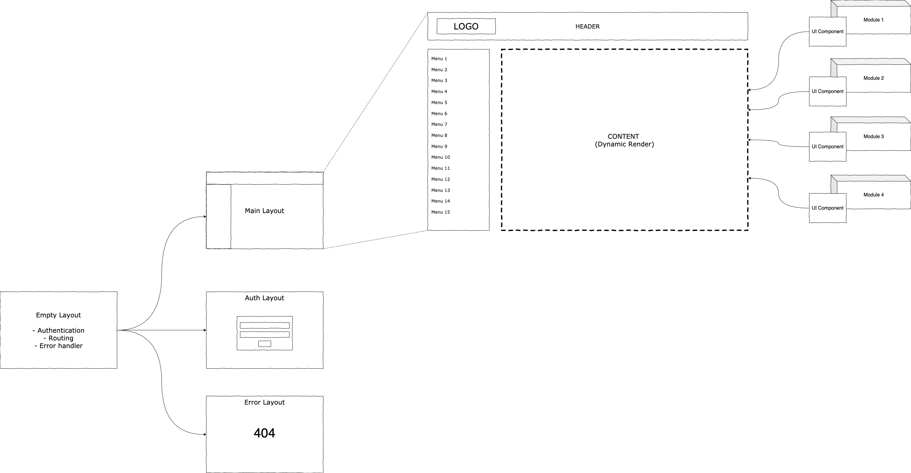

This is a [Next.js](https://nextjs.org/) project bootstrapped with [`create-next-app`](https://github.com/zeit/next.js/tree/canary/packages/create-next-app).

## Getting Started

First, run the development server:

```bash
npm run dev
# or
yarn dev
```

Open [http://localhost:3000](http://localhost:3000) with your browser to see the result.

You can start editing the page by modifying `pages/index.js`. The page auto-updates as you edit the file.


## Project Structure

A web structure consists of 4 main components.

1. Empty Layout
2. Main Layout
3. Authentication Layout
4. Error Layout




// Frontend Develop

// Env name
// File name : xxx-yyy.js
// Component name : XxxxYyyy
// Function name : xxxYyyy
// variable name : xxxYyy

// Css Tools
// style components

// Ant D
// Button , Popup 

// Text box => build by yourself